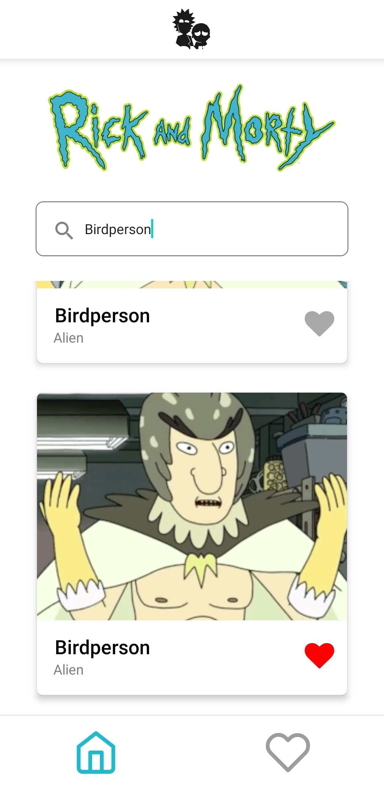

# Rick And Morty Characters App

## Introduction

A simple application that loads information from the [Rick and Morty API](https://rickandmortyapi.com/) and allows the user to search for characters by name and add them to a favorites list. Também é possível clicar no cartão dos personagens para ver mais informações sobre eles.

    
    
    
    
    
    

## Implemented features 
- [X] Home screen
- [X] Favourites screen 
- [X] Character screen 
- [X] Search character by name 
- [X] Add character to favourites list  
- [X] Remove character from favourites list 
- [X] "Not Found" message
